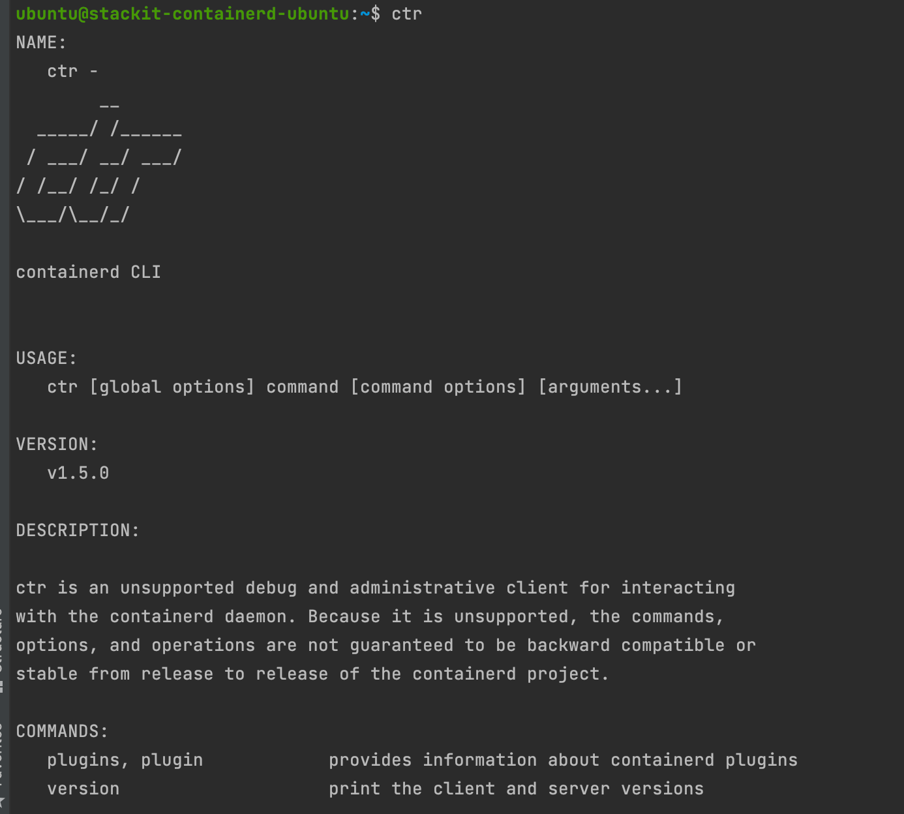

# stackit-containerd
STACKIT contained reference implementation via OpenStack

# Installion

Dont forget to create your own ssh key and use your own terraform backend. I use the azurerm again.

```hcl
backend "azurerm" {
  storage_account_name = "aebi"
  container_name       = "stackit-containerd-state"
  key                  = "stackit-containerd.tfstate"
}
```

## Infrastructure

Get the `*-openrc.sh` file and source it. 

```bash
source *-openrc.sh
```

Execute the Terraform.

```bash
cd 00-infrastructure
terraform init
terraform apply --auto-approve
```

## Provisioning (via Ansible)

Ansible installs the containerd, cni and nerdctl. Because we need to run the install of nerdctl rootless via `containerd-rootless-setuptool.sh install` I could not use the cloud-init approach.

```bash
ansible-playbook --private-key ssh/containerd -i 01-provisioning/hosts.yaml 01-provisioning/playbook.yaml
```

# Containerd

As Kubernetes grew and more third-party tools arose around Docker, the limitations of its architecture became clear. At the same time, the Open Container Initiative (OCI) began standardising container formats and runtimes. This resulted in an OCI specification defining a container which could be used by multiple runtimes, of which Docker is an example.

Docker then extracted its container runtime out into a new project, containerd. This includes Docker’s functionality for executing containers, handling low-level storage and managing image transfers. Containerd was donated to the Cloud Native Computing Foundation (CNCF) in order to provide the container community with a basis for creating new container solutions.

The emergence of containerd makes it easier for projects like Kubernetes to access the low-level “Docker” elements they need. Instead of actually using Docker, they now have a more accessible interface to the container runtime. The OCI standardisation of container technologies means other runtimes can be used too.


There are two kinds of container runtimes: high-level container runtimes and low-level container runtimes. 

Containerd is a high-level container runtime that uses Runc (a low-level container runtime) by default

# The role of containerd

Containerd drops in to abstract this low-level wiring. It’s intended as a “client layer” that container software then builds atop of. This might be developer-oriented software, like Docker, or cloud-oriented devops tools such as Kubernetes.

Previously, Kubernetes development was left with two bad options: keep writing shims around the hefty Docker interface, or start interacting with Linux kernel features directly. By breaking containerd out of Docker, a third alternative became available: use containerd as a system abstraction layer, without involving Docker.

# Installation
Follow the official docs for installing Containerd; or if you’re using Ubuntu, just install Containerd with apt.

# CTR

Some basic usage of the ctr-cli. I would suggest using the nerdctl-cli, if you seriously think about to substitute the docker-cli



Let us pull an image

`ctr image pull docker.io/library/busybox`

You will see an error saying you missed an object, because Containerd requires you to specify the object like the command below:

`ctr image pull docker.io/library/busybox:latest`

Let us list the image

`ctr image ls`

The result looks quite overloaded so with this command you only get the name of the image.

`ctr image ls -q`

To run a container, just use following command

`ctr container create docker.io/library/busybox:latest demo`

This creates a container with container id, 'demo'.

There are a few things to notice here: 

- The output is not redirected to the CLI by default. 
- We need to use the full path with the object every time we use a container image. 
- The image needs to be pulled before(!) being able to run a container.

Listing the containers we can to with the command below:

`ctr container list`

Deleting an image is possible with the command below.

`ctr image remove docker.io/library/busybox:latest`
 
What happens if the running container?

`ctr container list`

The container is still be running. The reason is containerd works on references. So the image is no longer being referenced as an image, but it is still being referenced by the container (as a snapshot).


And delete the image with:

`ctr container remove demo`

# nerdctl: Docker-compatible CLI for containerd

nerdctl is a Docker-compatible CLI for containerd.

✅ Same UI/UX as `docker`

✅ Supports Docker Compose (`nerdctl compose up`)

✅ Supports [rootless mode](./docs/``ootless.md)

✅ Supports [lazy-pulling (Stargz)](./docs/stargz.md)

✅ Supports [encrypted images (ocicrypt)](./docs/ocicrypt.md)

nerdctl is a non-core sub-project of containerd.

So basically it's close to your docker cli experience you already know and love.

`nerdctl pull busybox`

`nerdctl run -it busybox`

Thanks to the buildkit we can now build also container

`nerdctl build -t test:latest .`

To remove the container
`nerdctl rm 9a649cfb9c55`

Expose a port

`nerdctl run -d -p 8080:80 nginx`

```bash
ubuntu@stackit-containerd-ubuntu:~$ nerdctl ps
CONTAINER ID    IMAGE                             COMMAND                   CREATED          STATUS    PORTS                   NAMES
267de027eca9    docker.io/library/nginx:latest    "/docker-entrypoint.…"    4 seconds ago    Up        0.0.0.0:8080->80/tcp    
ubuntu@stackit-containerd-ubuntu:~$ curl http://localhost:8080
<!DOCTYPE html>
<html>
<head>
<title>Welcome to nginx!</title>
<style>
    body {
        width: 35em;
        margin: 0 auto;
        font-family: Tahoma, Verdana, Arial, sans-serif;
    }
</style>
</head>
<body>
<h1>Welcome to nginx!</h1>
<p>If you see this page, the nginx web server is successfully installed and
working. Further configuration is required.</p>

<p>For online documentation and support please refer to
<a href="http://nginx.org/">nginx.org</a>.<br/>
Commercial support is available at
<a href="http://nginx.com/">nginx.com</a>.</p>

<p><em>Thank you for using nginx.</em></p>
</body>
</html>
```

See the logs

`nerdctl logs -f 26`

```bash
/docker-entrypoint.sh: /docker-entrypoint.d/ is not empty, will attempt to perform configuration
/docker-entrypoint.sh: Looking for shell scripts in /docker-entrypoint.d/
/docker-entrypoint.sh: Launching /docker-entrypoint.d/10-listen-on-ipv6-by-default.sh
10-listen-on-ipv6-by-default.sh: info: Getting the checksum of /etc/nginx/conf.d/default.conf
10-listen-on-ipv6-by-default.sh: info: Enabled listen on IPv6 in /etc/nginx/conf.d/default.conf
/docker-entrypoint.sh: Launching /docker-entrypoint.d/20-envsubst-on-templates.sh
/docker-entrypoint.sh: Launching /docker-entrypoint.d/30-tune-worker-processes.sh
/docker-entrypoint.sh: Configuration complete; ready for start up
10.4.0.1 - - [18/May/2021:11:20:43 +0000] "GET / HTTP/1.1" 200 612 "-" "curl/7.68.0" "-"
```

Same goes for pushing into the registry
`nerdctl login -u <user>`

```bash
nerdctl push ediri/busybox:latest 
INFO[0000] pushing as a single-platform image (application/vnd.docker.distribution.manifest.v2+json, sha256:x) 
manifest-sha256:47b3642f37f00fffa0ee288483c13d61849af8c599227bd06fab1527b810aa3d: waiting        |--------------------------------------| 
layer-sha256:92f8b3f0730fef84ba9825b3af6ad90de454c4c77cde732208cf84ff7dd41208:    waiting        |--------------------------------------| 
config-sha256:20f9b62095fddfa3a3d1fbd8ff7ec03a9162ce91c7a5925a0a06a7352873174d:   waiting        |--------------------------------------| 
elapsed: 2.3 s                                                                    total:   0.0 B (0.0 B/s)        
```

And the best part bash completion:

```bash
source <(nerdctl completion bash)`
```

But unfortunately, there are some unimplemented commands still:

https://github.com/containerd/nerdctl/blob/master/README.md#unimplemented-docker-commands


Sources:

[[1]](https://www.cloudsavvyit.com/10075/what-is-containerd-and-how-does-it-relate-to-docker-and-kubernetes/)
[[2]](https://github.com/containerd/nerdctl/blob/master/README.md#command-reference)
